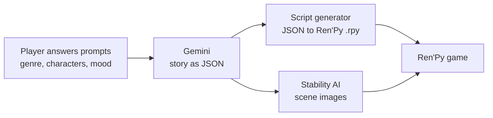

> **Note:** This is my fork of our team's project from **CodeDay Fall 2025, Seattle** ([showcase](https://showcase.codeday.org/project/cmhgqspw91903j5my04z26yk6)).
> Team: Akan A, Raimbek, Shamil, Umar T, Zhanbolot E and me.
>
> **What I built:** the Ren'Py game loop in [`VN_Creator/game/script.rpy`](VN_Creator/game/script.rpy). It keeps track of the current scene, moves the story forward when the player picks a choice, and styles the choice buttons, so the AI generated story can be played as a real game.

### How it works



---

# AI Visual Novel Creator

An AI-powered tool that automatically generates complete visual novels using Google Gemini and Stability AI. Simply provide your story ideas through an interactive interface, and the system generates the dialogue, script, and images to create a playable Ren'Py visual novel.

Link to CodeDay 2025 showcase - [link](https://showcase.codeday.org/project/cmhgqspw91903j5my04z26yk6)

## Features

- **Interactive Story Collection**: Step-by-step prompts gather your story narrative, genre, art style, characters, and mood
- **AI Story Generation**: Leverages Google Gemini 2.5 Flash to generate complete visual novel dialogue in JSON format
- **Automatic Script Generation**: Converts generated stories into Ren'Py (.rpy) script files
- **AI Image Generation**: Creates scene images using Stability AI with detailed scene descriptions
- **Ren'Py Integration**: Outputs ready-to-play visual novels compatible with Ren'Py engine

## How It Works

1. **Story Input**: Answer interactive prompts about your story (narrative, genre, art style, characters, etc.)
2. **Story Generation**: Gemini AI generates a complete visual novel story in structured JSON format
3. **Script Creation**: The story is converted into a Ren'Py script with character definitions and dialogue
4. **Image Generation**: Stability AI generates scene images based on scene descriptions
5. **Game Ready**: Launch your visual novel in Ren'Py!

## Installation

### Prerequisites

- Python 3.8 or higher
- Ren'Py SDK (for playing the generated visual novel)

### Setup

1. Clone or download this repository

2. Install required Python packages:
```bash
pip install google-generativeai python-dotenv requests pillow
```

3. Set up API keys:
   - Create a `.env` file in the project root
   - Add your API keys:
   ```
   GEMINI_API_KEY=your_gemini_api_key_here
   STABILITY_API_KEY=your_stability_api_key_here
   ```

4. (Optional) If you prefer using the hardcoded Gemini API key in the script, you can skip setting `GEMINI_API_KEY` in the `.env` file

## Usage

1. Run the main script:
```bash
python main.py
```

2. Follow the interactive prompts to define your visual novel:
   - Story narrative
   - Genre
   - Art style
   - Number of scenes
   - Main character details
   - Additional characters
   - Overall mood/tone

3. Wait for the AI to generate your visual novel:
   - Story generation with Gemini
   - Script conversion to Ren'Py format
   - Image generation for each scene

4. Play your visual novel:
   - Launch Ren'Py SDK
   - Open the `VN_Creator` folder as a project
   - Click "Launch Project" to play

## Project Structure

```
AI_Visual_Novel_Creator/
├── main.py                 # Main entry point - orchestrates the entire workflow
├── story_collector.py     # Interactive story input collection
├── story_generator.py     # Google Gemini integration for story generation
├── script_generator.py    # Ren'Py script conversion (.rpy files)
├── ImageGeneration.py     # Stability AI image generation
├── process_story.py       # Image generation orchestration for scenes
├── VN_Creator/            # Ren'Py game project folder
│   └── game/
│       ├── script.rpy     # Generated visual novel script
│       ├── images/        # Generated scene images
│       └── gui/           # Visual novel UI assets
└── README.md
```

## Generated Files

- `user_story_input.json` - Your story input saved as JSON
- `generated_story.txt` - AI-generated story in JSON format
- `VN_Creator/game/script.rpy` - Ren'Py script file
- `VN_Creator/game/images/*.png` - Scene images (one per scene)

## Technical Details

### Story Format

The generated stories use a structured JSON format:
```json
{
  "style_bible": "art style description",
  "scenes": [
    {
      "id": "s001",
      "bg": {"location": "...", "time": "..."},
      "characters": [{"name": "...", "look_key": "...", "pose": "..."}],
      "camera": "...",
      "mood": "...",
      "dialogue": ["..."]
    }
  ]
}
```

### Image Generation

Images are generated at 1920x1080 resolution in 16:9 aspect ratio for optimal visual novel display.

## Limitations

- Requires internet connection for API calls
- Image generation can take time depending on the number of scenes
- API usage costs apply for Gemini and Stability AI services

## Future Enhancements

- Branching dialogue and multiple endings
- Character sprite generation for different poses
- Multiple save slots support
- Custom UI theming
- Voice generation for dialogue

## License

This project is provided as-is for educational and personal use.

## Acknowledgments

- [Google Gemini](https://deepmind.google/technologies/gemini/) for story generation
- [Stability AI](https://stability.ai/) for image generation
- [Ren'Py](https://www.renpy.org/) for the visual novel engine


